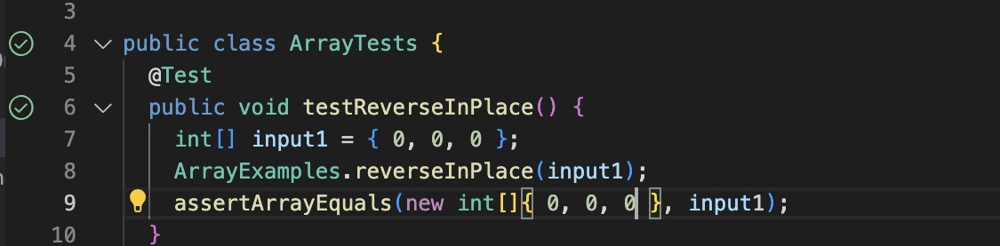

# Lab Report 2  

In this lab report, we will cover topics such as symptoms, failure inducing imputs, and web server creation.     

## StringServer    

In this portion, we will be creating a webserver, and having it display text by adding it to the path.  

First, we will create a server called StringServer. We will then add a string to its path. In this case, we added "Hello", so the pagfe should simply print "Hello", as such:

```
# code block
/add-message?s=Hello
```  
It will display this:    
  
The method handleRequest is used here in order to print out the output based on the path. This method uses a URI as a value to print the string "Hello". It also uses String.
  
Then, if we add this to the path:  
```
# code block
/add-message?s=How are you
```  
  
It should display this:    
  
This also used the method handleRequeest, and it uses URI to print "Hello" and "How are you?" It also uses String.


## Symptoms and Failure Inducing Input  

Symptoms and failure inducing input are two very important concepts when it comes to testing and assuring the quality of code. By using failure inducing imput, bugs can be found easily in code and fixed.   

In our labs, we used JUnit tests to test if our code was returning the correct output for our implemented input.   

We began with a buggy piece of code, and in order to find the bug, we implemented an example of failure inducing input in the following code:   

```
# code block
public class ArrayTests {
	@Test 
	public void testReverseInPlace() {
    int[] input1 = { 3, 4, 5 };
    ArrayExamples.reverseInPlace(input1);
    assertArrayEquals(new int[]{ 5, 4, 3 }, input1);
	}
```
  
The failure inducing input was that by using {3,4,5} when the array was not changed, for reversed the new array is empty, and so all elements are 0. The bug was that the initial output was {0,0,0} because the array was empty because we were assigning the array elements to an empty array.   

The corresponding input for the symptom in testReverseInPlace was [5, 4, 5] instead of [5,4,3].  

As you can see in the following code, the JUnit test is failed because the expected output of the array is not what the function returns, hence the bug.  



Because the array is empty at reversed, if you put in an expected output of [0,0,0], you will see that is passes the JUnit test in the image below.    


  
In order to fix this bug, you must change the code as such. From this:  

```
# code block
public class ArrayTests {
	@Test 
	public void testReverseInPlace() {
    int[] input1 = { 3, 4, 5 };
    ArrayExamples.reverseInPlace(input1);
    assertArrayEquals(new int[]{ 5, 4, 3 }, input1);
	}
```  

To this:  


```
# code block
public class ArrayExamples {
	// this will change the input array to be in reversed order 
static voidreverseInPlace() {
     for (int i = 0; i < arr.length / 2; i++){
    	int tmp = arr[i];
	arr[i] = arr[arr.length - i - 1];
	arr[arr.length - i - 1] = tmp;
     }
}
```  
This code will now correctly return an array in reversed order. The reason that this correctly fixes the big is that instead of originally comparing the reversed array to an array of zeroes, this new method runs a for loop that correctly fills the array in order of incrementing i, and then reverses the filled array returning the correctly reversed array.   

# What Did I Learn?


