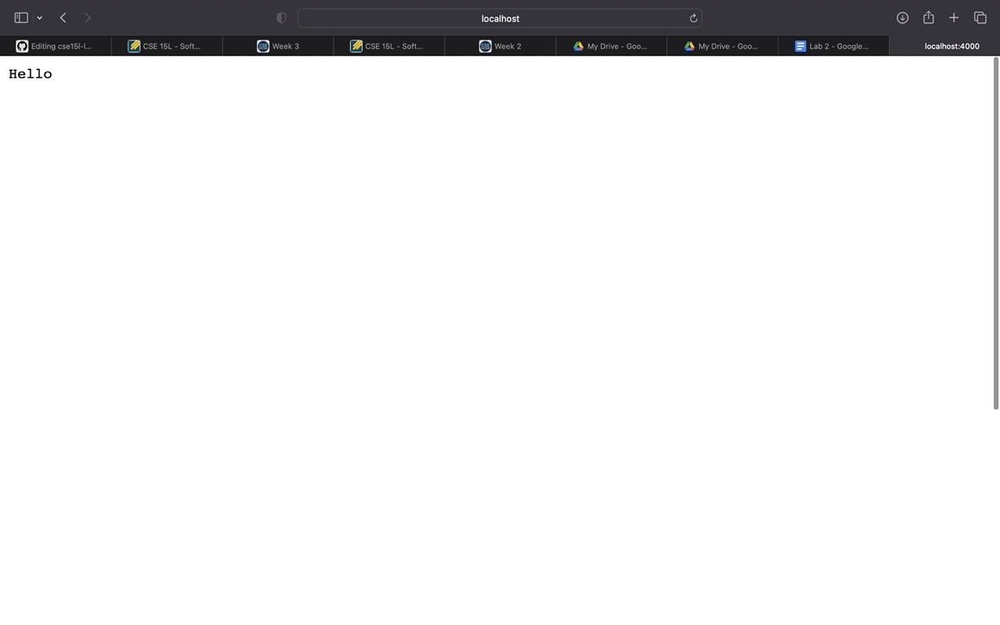
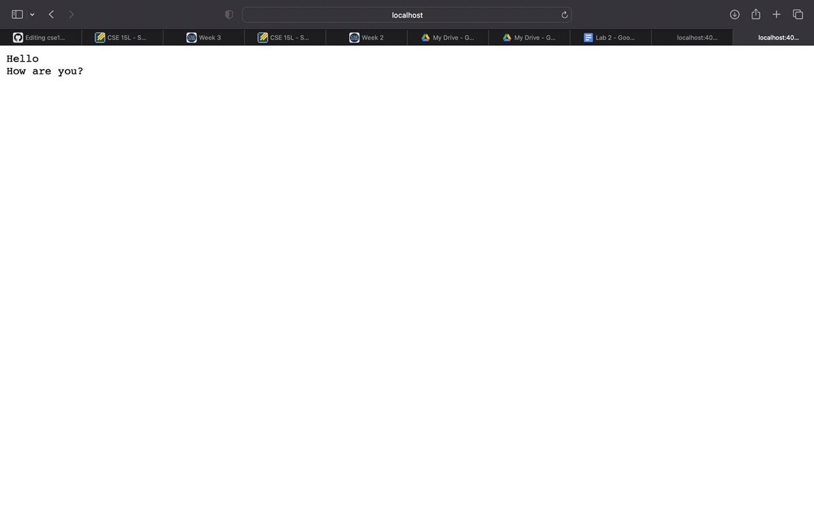
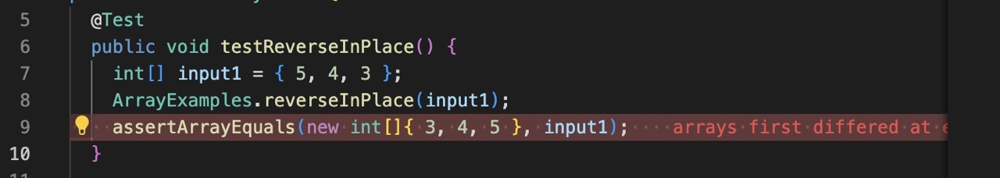
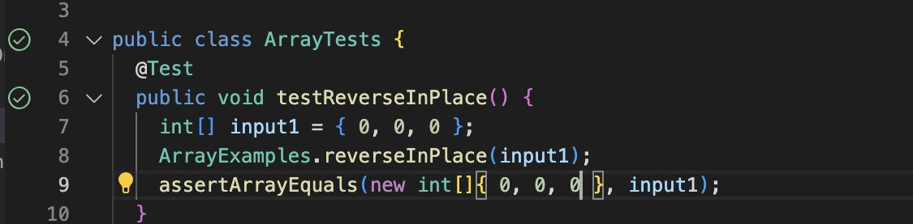

# Lab Report 2  

In this lab report, we will cover topics such as symptoms, failure inducing imputs, and web server creation.     

## StringServer    

In this portion, we will be creating a webserver, and having it display text by adding it to the path.  

First, we will create a server called StringServer. To create StringServer, we will write the following code:     

```
import java.io.IOException;
import java.net.URI;

class Handler implements URLHandler {
    // The one bit of state on the server: a number that will be manipulated by
    // various requests.
    int num = 0;

    public String handleRequest(URI url) {
        if (url.getPath().equals("/")) {
            return String.format("Hello\n" + "How are you?");
        } else if (url.getPath().equals("/increment")) {
            num += 1;
            return String.format("Number incremented!");
        } else {
            System.out.println("Path: " + url.getPath());
            if (url.getPath().contains("/add")) {
                String[] parameters = url.getQuery().split("=");
                if (parameters[0].equals("count")) {
                    num += Integer.parseInt(parameters[1]);
                    return String.format("Number increased by %s! It's now %d", parameters[1], num);
                }
            }
            return "404 Not Found!";
        }
    }
}

class StringServer {
    public static void main(String[] args) throws IOException {
        if(args.length == 0){
            System.out.println("Missing port number! Try any number between 1024 to 49151");
            return;
        }

        int port = Integer.parseInt(args[0]);

        Server.start(port, new Handler());
    }
}
```  
  
   
   We will then add a string to its path. In this case, we added "Hello", so the page should simply print "Hello", as such:

```
/add-message?s=Hello
```  
It will display this:     


  
The method handleRequest is used here in order to print out the output based on the path. This method uses a URI as a value to print the string "Hello". It also uses String.
  
Then, if we add this to the path:  
```
/add-message?s=How are you
```  
  
It should display this:      




There are several methods used in the creation of this server, and several objects that allow it to exist. The first is the URI object that is used. The URI object in this instance is handleRequest, which contains several calls to methods including getPath(), getQuery(), parseInt (), and equals(). This object takes in a url type URI. The purpose of the URI object is to distinguish one resource from another. The URI acts as the facilitator between resources. The strings of characters in a URI serve as identifiers, which can be names and file paths.   

Going back to the important methods stated early, getPath() plays an important function as it is a getter method that returns the path of the given file object, returning a string object which contains the path of the given file object. As it can be seen in the code above, getPath() is used to get the path of the file in handleRequest which takes a URI called url.   

Another important method is getQuery(). This method returns the Query of a specified URL, returning a String Type Query of a specified URL. The query is extracted from the data and is then returned in the format of a String. By tracing the process of handleRequest, it first checks if the path of a URL is equal to "/", and if it is it returns a String. However if it is not, it goes into the if statement where it checks if the url path contains "/add" by using the getQuery() function. If it does, it increments the number using parseInt() and returns a String.

There are several other important methods within the server, that all play a function in allowing it to run!


## Symptoms and Failure Inducing Input  

Symptoms and failure inducing input are two very important concepts when it comes to testing and assuring the quality of code. By using failure inducing imput, bugs can be found easily in code and fixed.   

In our labs, we used JUnit tests to test if our code was returning the correct output for our implemented input.   

We began with a buggy piece of code, and in order to find the bug, we implemented an example of failure inducing input in the following code:   

```
public class ArrayTests {
	@Test 
	public void testReverseInPlace() {
    int[] input1 = { 3, 4, 5 };
    ArrayExamples.reverseInPlace(input1);
    assertArrayEquals(new int[]{ 5, 4, 3 }, input1);
	}
```
  
The failure inducing input was that by using {3,4,5} when the array was not changed, for reversed the new array is empty, and so all elements are 0. The bug was that the initial output was {0,0,0} because the array was empty because we were assigning the array elements to an empty array.   

The corresponding input for the symptom in testReverseInPlace was [5, 4, 5] instead of [5,4,3].  

As you can see in the following code, the JUnit test is failed because the expected output of the array is not what the function returns, hence the bug.  



Because the array is empty at reversed, if you put in an expected output of [0,0,0], you will see that is passes the JUnit test in the image below.    


  
In order to fix this bug, you must change the code. The following code is the incorrect block, and is the code for reverseInPlace before the bug fix.   

```
public class ArrayTests {
	@Test 
	public void testReverseInPlace() {
    int[] input1 = { 3, 4, 5 };
    ArrayExamples.reverseInPlace(input1);
    assertArrayEquals(new int[]{ 5, 4, 3 }, input1);
	}
```  

To fix the bug, you will change the code to this:  


```
public class ArrayExamples {
	// this will change the input array to be in reversed order 
static voidreverseInPlace() {
     for (int i = 0; i < arr.length / 2; i++){
    	int tmp = arr[i];
	arr[i] = arr[arr.length - i - 1];
	arr[arr.length - i - 1] = tmp;
     }
}
```  
This code will now correctly return an array in reversed order. The reason that this correctly fixes the bug is that instead of originally comparing the reversed array to an array of zeroes, this new method runs a for loop that correctly fills the array in order of incrementing i, and then reverses the filled array returning the correctly reversed array. The extra lines that were added mathematically changed the output. By adding the following for loop:   
```

     for (int i = 0; i < arr.length / 2; i++){
    	int tmp = arr[i];
	arr[i] = arr[arr.length - i - 1];
	arr[arr.length - i - 1] = tmp;
     }
```    
the method scanned the array up to half of its length, then changed the newly implemented integer tmp so that the list would be in reverse order.  
  


## What Did I Learn?  

Of the many things that we learned in labs two and three that I did not know before, I think that what stuck with me the most was how you can add commands to a server's URI in order to have it display things on the server. I found this very interesting because I believe it can save a lot of time, allowing for one to be able to simply add commands of what they want to see to the URI, rather than having to go in and code it. 


