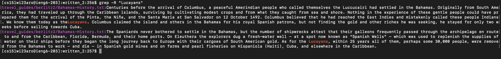

# Lab Report 3  

In this lab report, I will be exploring different command line options for the grep command, and showing that there are many more ways to use it!  
  
## The 'grep' Command   

The grep command is a command used to search and match text files contained in the regular expression. This command is very important because it can help find files in large databases. 
  
 There are many different commands that can be used with grep, and here are a few of them. 
   
## -c
  
The grep -c command prints only a count of the lines that match a pattern in a file. For example, you will give them comand grep -c "Lucayans" written_2.txt. This will return a number like "2". It will look like this.   

```

[cs15lwi23aro@ieng6-203]:skill-demo1-data:297$ grep -c "Lucayans" written_2.txt
     
[cs15lwi23aro@ieng6-203]:skill-demo1-data:297$ 2
```          
The reason that this is a useful command for this example is that it gives you the number of lines that match the pattern in a file that you pass it. For example, instead of having to manually count how many times "Lucayans" appears in a set of files, you can simply use the grep -c command and it will return the number for you, which in this case was 2 files. This can help with file management, word counts, and many more things. 

Here is another example of me doing it using the word "Athens" instead:


```

[cs15lwi23aro@ieng6-203]:skill-demo1-data:297$ grep -c "Athens" written_2.txt
     
[cs15lwi23aro@ieng6-203]:skill-demo1-data:297$ 174
```        

In this example, this is a useful command because it gives you the number of lines that match "Athens" in the written_2 folder, when you pass it the command. Instead of having to manually count how many times the pattern appears in a written_2, you can simply use the grep -c command and it will return the number for you. In this case, it was 174. 

    
## -r  

The grep -r command lists all of the files within a directory where a certain keyword appears. For example, in the following screenshot, I typed in "grep -r "Lucayans" and it gave me all of the files within the written_2 directory where the word "Lucayans" appears. 
  
My command:  

```

[cs15lwi23aro@ieng6-203]:skill-demo1-data:297$ grep -r "Lucayans" 
     
```      

    
  
This is useful in this example because you pass "Lucayans" with the grep -r command, and it only gives you the files where "Lucayans" appears.   


Here is the same command used again but now with the keyword "Athens". As you can see, the result is not short!      
  
My command:  

```

[cs15lwi23aro@ieng6-203]:skill-demo1-data:297$ grep -r "Athens" 
     
```     

   

This is a very useful command because it returns the files where a certain keyword that is passed appears. The reason that this is useful is because if you have a large database with many files, but you only want to read about a certain topic, you can find which files to look into for this topic by using grep -r, without having to read through each file until you find it. Not only does it return the files, but it only returns the file names so that your terminal is not filled up with a lot of words, and you can simply look at which files to read into. 


  
## -l
Another grep command that is commonly used is -l. By using the -l, it means that you are asking for it to show the file name, not the result itself. As you can see, this now shows you where the word "Lucayans" appears, but not the entire file itself.    

```

[cs15lwi23aro@ieng6-203]:skill-demo1-data:297$ grep -rl "Lucayans" 
     
```     

    

This was a useful command in this example because as you can see, when it was passed "Lucayans" with the grep -rl command, it only returned the file names where that keyword appeared. This made it very easy for me to see which files 

Here is another example of using the grep -l command with another key word "Athens".    

```

[cs15lwi23aro@ieng6-203]:skill-demo1-data:297$ grep -rl "Athens" 
     
```   

     

The reason that this is a very useful command is because it returns the file names where a certain keyword that is passed appears. This is useful because if you have a large number of files, but you only want to read about a certain topic, you can find which files to look into for this topic by using grep -r, without having to read through each file until you find it. Not only does it return the files, but it only returns the file names so that your terminal is not filled up with a lot of words, and you can simply look at which files to read into. 

## -o  

Another useful grep command is grep -o. The -o command means that you want to only print the matched parts of a matching line,
 with each such part on a separate output line. Here is an example of this command:  
 
 Input:  
 
 
 ```

[cs15lwi23aro@ieng6-203]:skill-demo1-data:297$ grep -o "Lucayans" written_2.txt
     
```     
Output:   
 ```
Lucayans
Lucayans
Lucayans
Lucayans
Lucayans

```         

This is an example where the command will be useful because if I am looking for a list of the matching parts of a keyword without all of the text, I can use this command and it only gives me the keywords. 

Here is another example of this using the keyword "Athens" instead.   

Input:  
 
 
 ```

[cs15lwi23aro@ieng6-203]:skill-demo1-data:297$ grep -o "Athens" written_2.txt
     
```     
Output:   
 ```
Athens
Athens
Athens
Athens
Athens

```         

In this example, the command is useful because I wanted all of the times the keyword "Athens" was printed in the files, and it returned it to me without the text which makes it very easy to read and locate without filling the entire terminal. 
  
It is clear that there are many different options for using grep commands, and these are just some of the few. The best part about this is that for every task that you need to do with your command line, there is an optimal way to find it, and it just has to be found!

  
For citation purposes, I found my grep command line options at this URL:   
  
[Link](https://www.geeksforgeeks.org/grep-command-in-unixlinux/)

