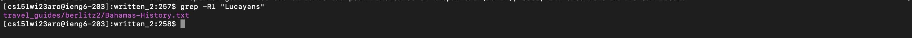

# Lab Report 3  

In this lab report, I will be exploring different command line options for the grep command, and showing that there are many more ways to use it!  
  
## The 'grep' Command   

The grep command is a command used to search and match text files contained in the regular expression. This command is very important because it can help find files in large databases. 
  
 There are many different commands that can be used with grep, and here are a few of them. 
   
## -c
  
The grep -c command prints only a count of the lines that match a pattern in a file. For example, you will give them comand grep -c "Lucyans" written_2.txt. This will return a number like "2". Here is a visual example of me running this command:   
    
## -r  

The grep -r command lists all of the files within a directory where a certain keyword appears. For example, in the following screenshot, I typed in "grep -r "Lucayans" and it gave me all of the files within the written_2 directory where the word "Lucayans" appears.    

    

Here is the same command used again but now with the keyword "Athens". As you can see, the result is not short!  

  
## -l
Another grep command that is commonly used is -l. By using the -l, it means that you are asking for it to show the file name, not the result itself. As you can see, this now shows you where the word "Lucayans" appears, but not the entire file itself.   

  

Here is another example of using the grep -l command with another key word. 
