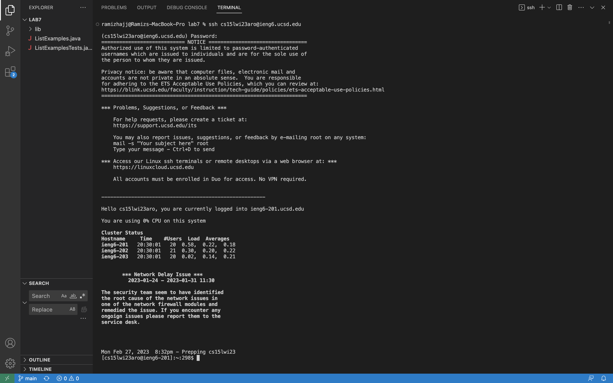

# Lab Report 4  

In this lab, I will be reproducing the steps I took to complete the race and explaining how I did each of them in detail. The point of doing this was to do it as fast as possible.   

Here are the steps from the competition, along with the process I went through to complete it.  


## Log into ieng6  

The command I used to log in was:

```
ssh cs15lwi23aro@ieng6.ucsd.edu
```   
  
I then entered my password and it logged me in. The screen looked like this:  

   


## Clone your fork of the repository from your Github account  
The next step was to clone the fork of the repository. To do this, I used the following command: 
```
git clone https://github.com/ucsd-cse15l-w23/lab7
```   
To get the link, it was already saved, and to save time I used <up> <up> on my keyboard so that I did not have to manually type in the link.

Run the tests, demonstrating that they fail  
To run the tests, I used the following code:   
  
```
javac -cp .:lib/hamcrest-2.2.jar:lib/junit-4.13.2.jar *.java
java  -cp .:lib/hamcrest-core-1.3.jar:lib/junit-4.13.2.jar org.junit.runner.JUnitCore 
```    
  
The exact keys I used were "up" "up" "enter".  
  
This showed that the unit tests failed, meaning that I needed to make changes to the code to have it work. 
  
## Edit the code file to fix the failing test   
  
To edit the code and get it to run without failing the test, I used the following command:  
  
  ```
nano ListExamples.java
```       
  
  This is what it looked like:  
  
  
 

 

## Run the tests, demonstrating that they now succeed  
  
Now, to run the tests again and ensure that they succeed, I used <up><up><up><up> enter. This is the code that was put in:
```
javac -cp .:lib/hamcrest-2.2.jar:lib/junit-4.13.2.jar *.java
java  -cp .:lib/hamcrest-core-1.3.jar:lib/junit-4.13.2.jar org.junit.runner.JUnitCore 
```      
  
These commands were 4 up in the command line, so I just ran them the same way. 
  
The tests now passed. 

Commit and push the resulting change to your Github account  
  
To commit and push the changes I used the following commenads.   
  
```
git status       
git commit -m "last commit"
git push origin status 
```     
This time, instead of using the desktop app, I committed and pushed the changes from the command line.   
The keys I used were "up" "enter" three times, one for each line. 
  
By using the shortcuts that I showed, I was able to complete all of the tests in around 10 minutes, but I did not win the competition. 
  

