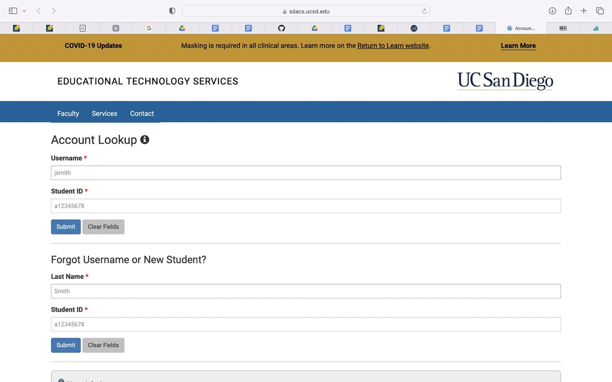
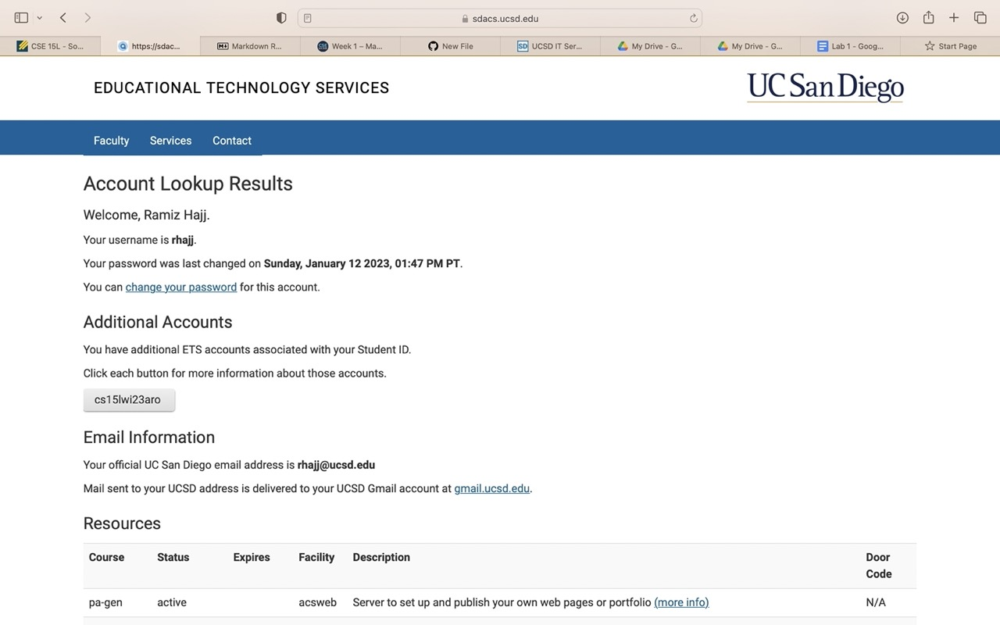
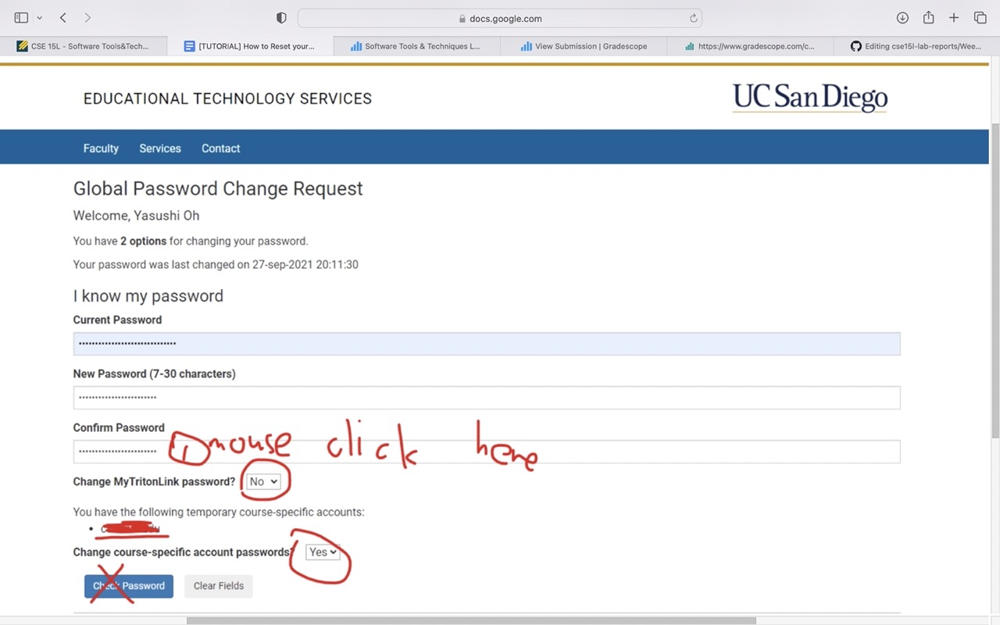
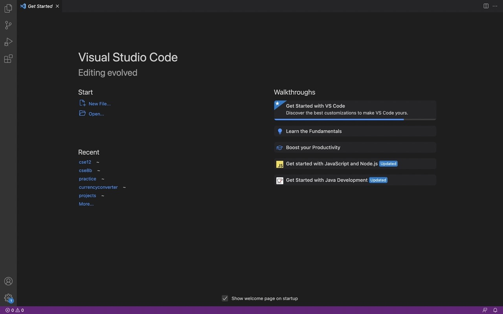
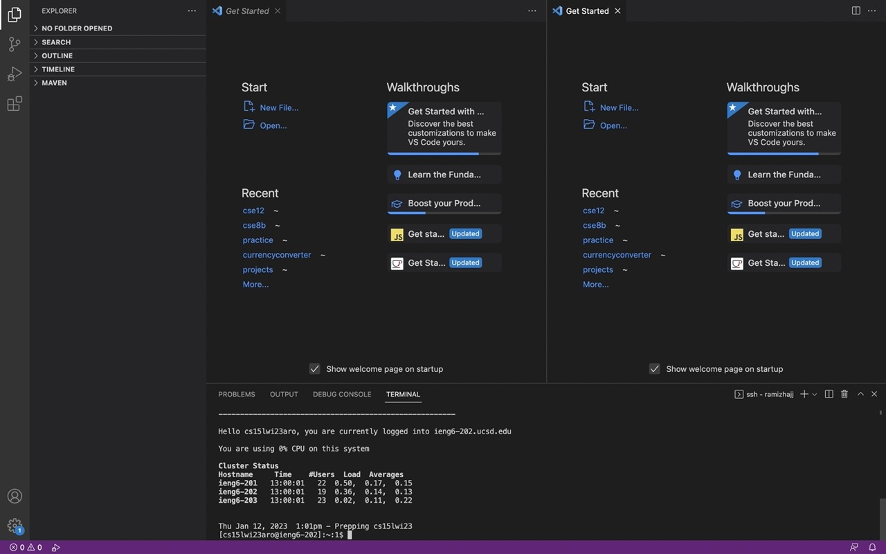
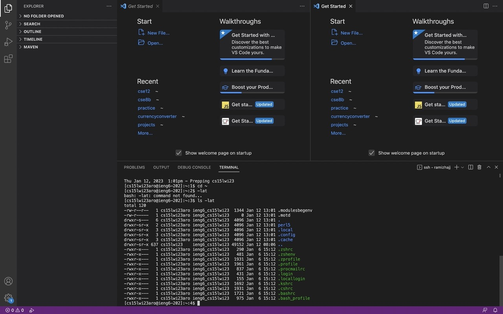

# Lab Report 1
## Welcome to CSE 15L: *Software Tools and Techniques*!  

In this class, many skills that are beneficial in programming will be taught, practiced, and demonstrated through skill checks and lab reports.
  
  
To start things off, I will be talking about remote access and logging in to your course specific account!  
  
  
## Logging In To Your Account  
  
Every CSE 15L student has a course-specific account which they can log in to using their UCSD username and student PID.   

To access your account, click this link here: [[Link](https://sdacs.ucsd.edu/~icc/index.php)] 

The screen will look like this and the student will input their UCSD username and student PID.    

  
 Upon logging in with these credentials, the screen should look like this. It may be necessary for the student to change their password.

. 

If you look towards the top of the screen, there is a link that will guide you to change your password.   

Once you click the link, you will be prompted to enter your username, and your current password. It will also ask you to type your new password, which must consist of numbers, letters (uppercase and lowercase), and symbols. The more complicated your password, the more likely it is to keep your account secure.   

At this point, instead of clicking the blue 'Check password' button, you will simply click enter with your mouse in the input box. The following photo that I have borrowed from the course website will show which button and which input box the user shoudl click.      

  
  
 After this, if all is successful, you should be able to reset your password. It will take 15-30 minutes to become effective, but you will be able to use it after that!

## Installing and Using VSCode

Installing and using VSCode is an important part of this class. Here we will be writing and executing a lot of our code. To install VSCode, you will want to go to the following link: https://code.visualstudio.com/, and follow the instructions to download and install it on your computer. This link includes versions for all the major operating systems, like macOS (for Macs) and Windows (for PCs).     

The good thing about VSCode is that if installed on your own device, you can connect whenever you want from wherever and code there. Once installed, it should show you a screen like this. Mine already has a few directories because I had it previously installed.   
  
  
  
  
Once you are into VSCode, you can create files, folders, and start running code. You can even open up a terminal and run commands through VSCode.
  
## Remotely Connecting
  
The next step is to remotely connect to the server. This is very helpful to be able to work collaboratively and to be able to conect to a server from anywhere.   

The first step you want to take is to use ssh by typing this command into your terminal: $ ssh cs15lwi23zz@ieng6.ucsd.edu.   

It will then return the following message:   
ssh cs15lwi23zz@ieng6.ucsd.edu
The authenticity of host 'ieng6-202.ucsd.edu (128.54.70.227)' can't be established.
RSA key fingerprint is SHA256:ksruYwhnYH+sySHnHAtLUHngrPEyZTDl/1x99wUQcec.
Are you sure you want to continue connecting (yes/no/[fingerprint])? 
Password:  

to which you will respond 'y' and enter your password that you created earlier. You are now connected and your terminal should show something like this:   
  
  
  
Once you log in, I got a welcome message with my username and the computer that I have remotely connected to. I got the percentage of usage of CPU, and then I am told the cluster status along with a table that lists the hostname, time, #users, load, and averages. This is all information about the computer that I am connecting to. 

  
## Running Some Commands  
  
You have now gotten to the point where you should be all set to start running some commands on your terminal. For this, open up VSCode and open your terminal. There are many commands you can run, here is an example of a couple:   
  
  
  
Here as you can see, I ran the cd~ and the ls -lat commands. The cd~ command just changed me back into the parent directory. The ls -lat command listed files in order of most recently modified. There are many other commands you can run and actions that can be done in the terminal.   
  
These however, are not the only commands that can be run. Here are a few more commands that you can try, along with some output errors that they may produce.   
  
The cd~ and ls -lat commands are already displayed above.  

The ls command lists the other files/folders in the parent directory of the home directory. Some errors it may produce are not listing the correct files, due to not being in the correct parent directory and not being able to locate the files.   

The /home/linux/ieng6/cs15lwi23/public/hello.txt command can also be ran to concatenate, you will get an error if you mis-spell the file hello.txt.    

The cp /home/linux/ieng6/cs15lwi23/public/hello.txt ~/ file will also give a file not found error if you mis-spell the file hello.txt.  

And finally, the ls <directory> where <directory> is /home/linux/ieng6/cs15lwi23/cs15lwi23abc, where the abc is one of the other group members’ username will give you an error because the file will not be found due to it being connected to a different place. 

## Conclusion  
You have now reached the end of the tutorial and are ready to star working on your projects, good luck!

